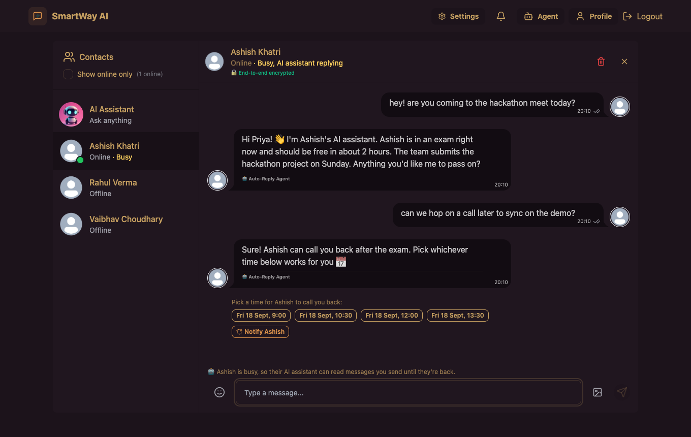
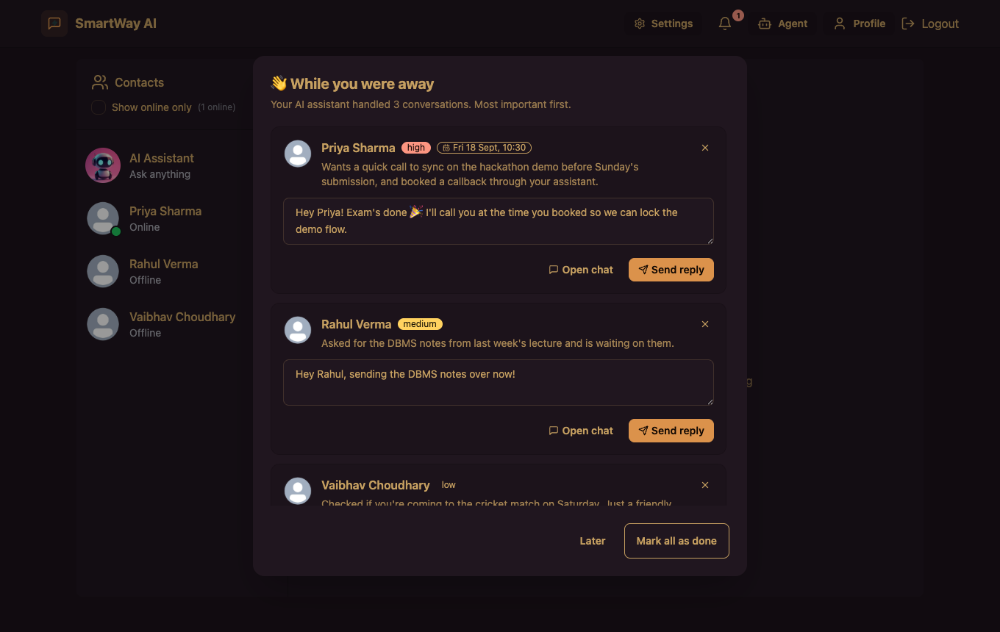
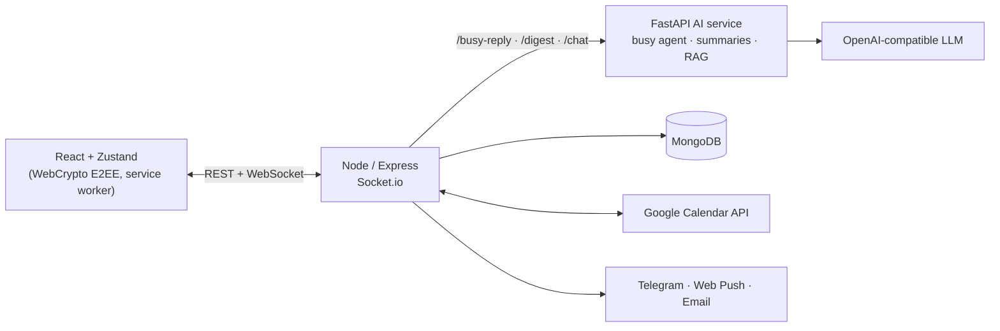
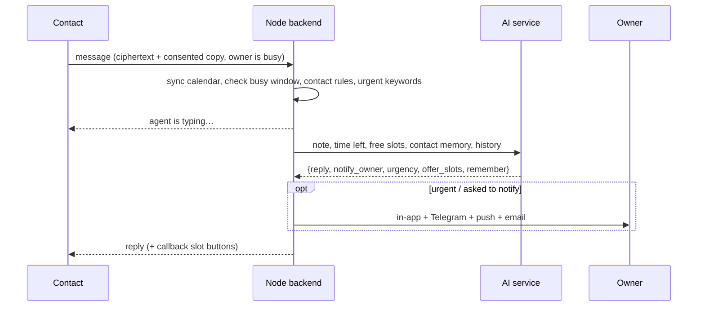

# SmartWay AI

**A real-time chat app where an AI agent talks to people for you while you're busy, and knows when to pull you back in.**

When you're in an exam, a meeting or just offline, your agent answers your contacts in your chosen tone, answers from a note you leave, offers callback times from your Google Calendar, and alerts you on Telegram, push or email when something is urgent. When you're back, it hands you a prioritised summary with replies ready to send. Messages are end-to-end encrypted, and the agent only reads what people send while you're busy, with a clear notice in the chat.



## What it does

**Busy-mode AI agent**
- Holds a real conversation with anyone who messages you, using a note you leave ("In my exam until 5 PM, we submit the hackathon on Sunday")
- Personality: friendly, professional or funny
- Remembers short facts about each contact and follows up next time
- Never makes promises on your behalf. It offers to notify you instead

**Knows when to interrupt you**
- Contacts can ask the agent to notify you, or tap **Notify**
- Contact rules: *always notify me*, *treat as urgent*, *fixed message only*
- Urgent keywords ("server down") alert you immediately
- Alerts go to the in-app bell, email, a **Telegram bot** and **web push**, with per-channel toggles and spam protection

**Calendar-aware scheduling**
- Connect **Google Calendar**: busy mode turns on during your events, and contacts see "Busy" but never your event titles
- The agent offers free 30-minute **callback slots** in your working hours and time zone; bookings land on your calendar with reminders for both people

**While you were away**
- When busy mode ends, you get each conversation summarised and sorted by priority, with a suggested reply you can edit and send in one tap



**Agent dashboard**
- Replies handled, conversations, alerts, callbacks and estimated time saved, a replies-per-day chart, upcoming callbacks and everything the agent remembers (with *Forget*)


Plus the chat basics: real-time messaging with Socket.io, online status, reactions, images, email verification, Google sign-in, themes, and an in-app AI Assistant that answers questions about the app using RAG.

## Architecture



How a message to a busy user is handled:



Design notes:
- **One reply at a time per conversation.** Messages that arrive while the agent is generating are answered right after, never dropped.
- **The AI service returns structured JSON**, so the backend acts on decisions (notify, offer slots, remember) instead of parsing prose. Malformed output still gets delivered as a reply.
- **It fails safely.** If the LLM is down, contacts get a neutral fallback that never exposes your private note, and the real error is logged.
- **Time zones are respected.** Slots, reminders and stats are all computed in each user's own time zone.

## Security and privacy

- **End-to-end encryption.** Each user has a P-256 key pair generated in the browser. The private key stays on the device (IndexedDB, non-extractable). The server stores only the public key and a copy of the private key encrypted with your **chat PIN** (PBKDF2-SHA256, 600k iterations). Conversation keys are ECDH → HKDF bound to both user ids, and messages are AES-256-GCM.
- **New device:** enter your PIN. **Forgot PIN:** reset keys, and older messages become unreadable. **Logout** removes the key from that device.
- **The agent's access is visible.** The agent can only read messages sent while you're busy: the sender's chat shows a notice, and only then does their browser share a readable copy. Other messages reach the agent as "private message" placeholders.
- **Tokens are protected.** Google refresh tokens are encrypted at rest, and sockets are authenticated with the same JWT cookie as the API.
- **Known limits:** images aren't end-to-end encrypted, and a weak PIN can be brute-forced by someone who has the database, so use a longer passphrase.

## Tech stack

React 18, Vite, Zustand, Tailwind + DaisyUI · Node.js, Express, Socket.io, Mongoose · Python, FastAPI, OpenAI SDK, LangChain + Qdrant (optional RAG), mem0 (optional memory) · MongoDB · Google Calendar API, Telegram Bot API, Web Push (VAPID), Brevo / Resend / SMTP.

## Run it locally

Requirements: Node 20+, Python 3.10+, MongoDB, an OpenAI (or compatible) API key.

```bash
# 1. AI service (http://localhost:8000)
cd ai-agent
pip install -r requirements.txt
cp .env.example .env   # add OPENAI_API_KEY
uvicorn main:app --port 8000

# 2. Backend (http://localhost:5002)
cd backend
npm install
cp .env.example .env   # add MONGODB_URI, JWT_SECRET, Cloudinary keys
npm run dev

# 3. Frontend (http://localhost:5173)
cd frontend
npm install
npm run dev
```

Qdrant is optional: without it, the AI Assistant answers from the Markdown docs in `ai-agent/rag_data`.

## Configuration

### Backend (`backend/.env`)

| Variable | Required | Purpose |
|---|---|---|
| `MONGODB_URI`, `JWT_SECRET`, `PORT`, `NODE_ENV` | yes | Database, auth, server |
| `CLOUDINARY_CLOUD_NAME`, `CLOUDINARY_API_KEY`, `CLOUDINARY_API_SECRET` | yes | Image uploads |
| `AI_URL` (dev) / `AI_URL_PROD` (prod) | yes | AI service URL (host is enough) |
| `CLIENT_URL` | prod | Public app URL, used for links, CORS, OAuth and webhooks |
| `BREVO_API_KEY` or `RESEND_API_KEY` (+ `EMAIL_FROM`) or `EMAIL_USER` + `EMAIL_PASS` | for email | Email delivery |
| `GOOGLE_CLIENT_ID` (+ `VITE_GOOGLE_CLIENT_ID` at build) | optional | Google sign-in |
| `GOOGLE_CLIENT_SECRET` | optional | Google Calendar (also needs `GOOGLE_CLIENT_ID`) |
| `TELEGRAM_BOT_TOKEN` (`TELEGRAM_BOT_USERNAME` optional) | optional | Telegram alerts |
| `VAPID_PUBLIC_KEY`, `VAPID_PRIVATE_KEY` (`VAPID_SUBJECT` optional) | optional | Web push alerts |
| `TOKEN_ENCRYPTION_KEY` | recommended | Encrypts stored Google tokens (falls back to `JWT_SECRET`) |

Optional features switch themselves off cleanly when their variables are missing, and the Settings page says so.

### AI service (`ai-agent/.env`)

| Variable | Required | Purpose |
|---|---|---|
| `OPENAI_API_KEY` | yes | LLM access |
| `OPENAI_MODEL` | no | Defaults to `gpt-4o-mini` |
| `OPENAI_BASE_URL` | no | Any OpenAI-compatible provider (Groq, OpenRouter, …) |
| `QDRANT_URL` | no | Vector store for RAG and long-term memory |

### Setting up the optional integrations

**Google Calendar**
1. In Google Cloud Console, enable the **Google Calendar API** for the project that owns your OAuth client.
2. Add the scope `https://www.googleapis.com/auth/calendar.events` to the OAuth consent screen, and add yourself as a test user while the app is in testing.
3. Add the redirect URI `<CLIENT_URL>/api/calendar/oauth/callback` (locally `http://localhost:5002/api/calendar/oauth/callback`).
4. Set `GOOGLE_CLIENT_SECRET` on the backend.

**Telegram**
1. Create a bot with [@BotFather](https://t.me/BotFather) and copy the token into `TELEGRAM_BOT_TOKEN`.
2. The backend registers its webhook automatically in production and polls in development.
3. Users connect from **Settings → Alerts → Connect**.

**Web push**
1. Generate keys once with `npx web-push generate-vapid-keys`.
2. Set `VAPID_PUBLIC_KEY` and `VAPID_PRIVATE_KEY`.
3. Users enable push per device from **Settings → Alerts**.

## Deploying on Render

`render.yaml` defines both services: the Python AI service, and the Node service that also serves the built frontend. The Node service needs `AI_URL_PROD` pointing at the AI service, and the AI service needs `OPENAI_API_KEY`. If replies fall back to a generic message, check the Node service logs for `AI service /busy-reply failed:`, which shows the real LLM error.

## Project structure

```
ai-agent/    FastAPI: busy agent, away summaries, AI Assistant (RAG), LLM client
backend/     Express API, Socket.io, busy agent orchestration, calendar, alerts, E2EE key storage
frontend/    React app: chat, agent dashboard, settings, WebCrypto E2EE, service worker
docs/        Screenshots
```
